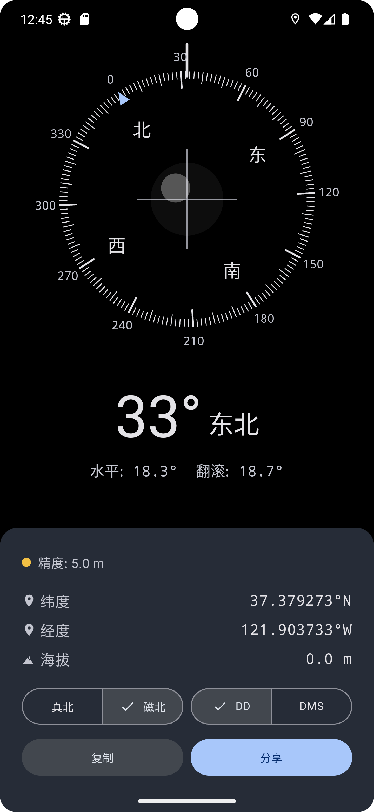

# 原点罗盘 (Pixel Geo)

<p align="center">
  
</p>

<p align="center">
  <strong>一款纯粹、专业的跨平台指南针与经纬度测绘工具。</strong>
</p>

<p align="center">
    <a href="https://github.com/Mystery00/PixelGeo/releases/latest"></a>
    <a href="https://play.google.com/store/apps/details?id=vip.mystery0.pixel.geo"></a>
    <a href="https://apps.apple.com/cn/app/%E5%8E%9F%E7%82%B9%E7%BD%97%E7%9B%98/id6760229476"></a>
    <a href="LICENSE"></a>
</p>

## 项目简介

**原点罗盘 (Pixel Geo)** 是基于 Kotlin Multiplatform (KMP) 与 Compose Multiplatform 开发的开源工具应用。它专注于提供最原始、最精准的地理位置数据，直接调用硬件 API 获取 **WGS-84** 原始坐标，规避国内地图常见的偏移问题。

### 核心功能

*   **实时方位角**：提供 0° - 359° 高精度朝向显示，支持**真北 (True North)** 与 **磁北 (Magnetic North)** 切换。
*   **WGS-84 原始坐标**：直接输出未经加密偏移的经纬度数据，适合专业测绘与户外探险。
*   **坐标格式切换**：支持“度分秒 (DMS)”与“十进制度数 (DD)”双格式切换。
*   **实时海拔高度**：显示当前位置的海拔数据。
*   **GPS 信号质量监测**：直观反馈水平定位精度（<10m 优秀，10-50m 良好，>50m 较差）。
*   **坐标分享与复制**：一键生成标准坐标文本，支持系统级分享。

## 应用截图

<p align="center">
  
</p>

## 技术栈

*   **跨平台框架**：Compose Multiplatform (Android / iOS)
*   **架构模式**：Clean Architecture + MVI (Model-View-Intent)
*   **异步处理**：Kotlin Coroutines & Flow
*   **依赖注入**：Koin
*   **权限管理**：MOKO Permissions
*   **本地存储**：AndroidX DataStore Preferences

## 项目结构

*   `composeApp/commonMain`: 共享的 UI (Compose) 与业务逻辑 (ViewModel/UseCase)。
*   `composeApp/androidMain`: Android 平台特定实现（SensorManager, FusedLocation）。
*   `composeApp/iosMain`: iOS 平台特定实现（CLLocationManager）。

## 构建与运行

### Android
```bash
./gradlew :composeApp:assembleDebug
```

### iOS
1. 在 macOS 上使用 Xcode 打开 `iosApp` 目录。
2. 运行 `iosApp` 方案。

## 相关文档

*   [隐私政策](PRIVACY.md)

## 许可证

本项目采用 Apache License 2.0 许可证。详情请参阅 [LICENSE](LICENSE) 文件。
